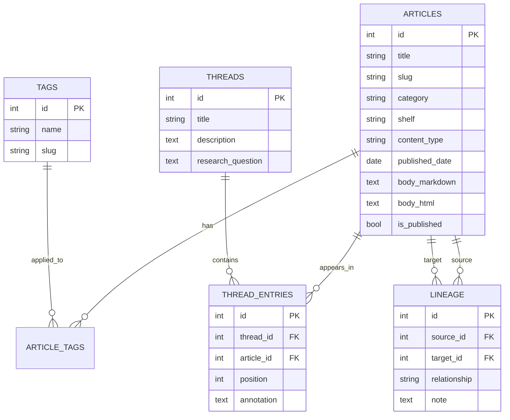
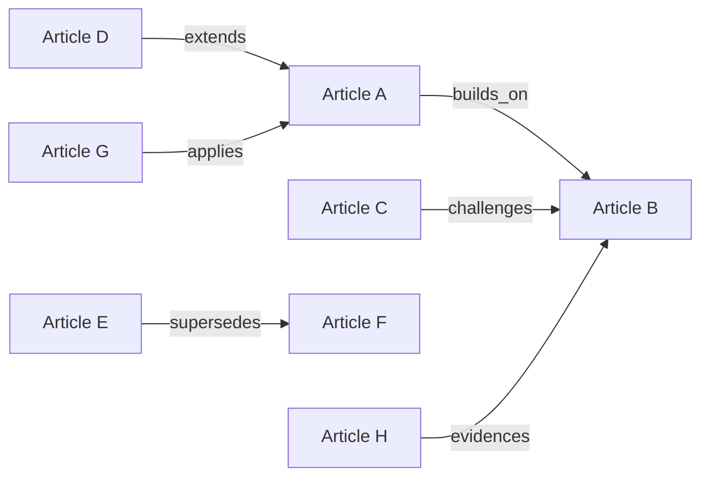
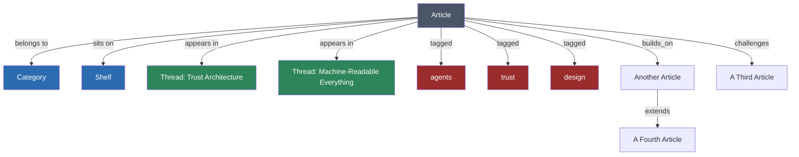
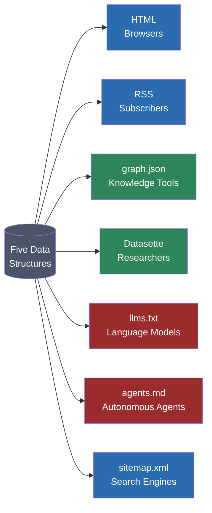
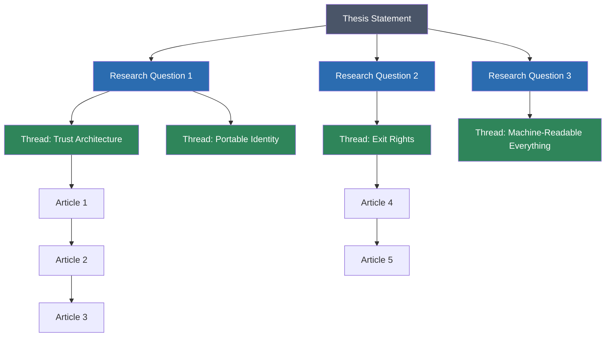
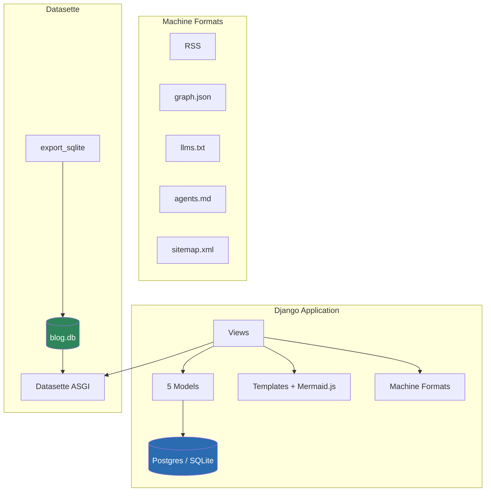
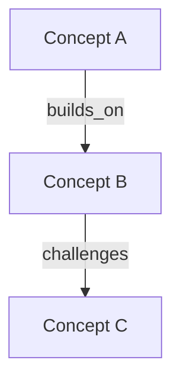
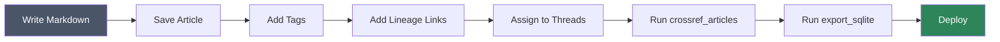

# Memex Weblog Template

A structured research weblog with five interlocking data models and seven machine-readable output formats. Not a blog — a knowledge architecture.

Named after Vannevar Bush's 1945 [Memex](https://en.wikipedia.org/wiki/Memex) — a theoretical device for storing, linking, and retrieving all of a person's knowledge.

---

## The problem

Most personal websites are flat. Posts in a reverse-chronological feed, maybe categories, maybe tags. That structure rewards recency. It doesn't reward the thing that actually matters for a research program: **the relationship between ideas over time**.

A chronological blog can't tell you that article A builds on article B, or that article C challenges article B's premise. It can't organize five articles into a reading path that makes an argument. It can't serve the same knowledge to a browser, a language model, and an autonomous agent simultaneously.

This template can.

## Architecture

### Five data models

The core insight: a single article exists in at least five simultaneous contexts. No article is isolated. Every article is a node in a graph.



**1. Articles** are the visible layer — typed content with categories, shelves, publication dates, and content types (article, project, archive, page). But articles alone are just a filing cabinet.

**2. Tags** create thematic crosscuts across the corpus. Lightweight, many-to-many. An article about trust might also be tagged with agents, attestations, and design.

**3. Threads** are curated reading paths. Each thread is organized around a thesis question and contains articles in a specific order, each with an annotation explaining why it's there. The same article can appear in multiple threads with different annotations. The thread is the argument. The article is the evidence.

**4. Lineage** links are typed relationships between articles. Six relationship types:



| Type | Meaning |
|------|---------|
| `builds_on` | Uses the target's argument as a foundation |
| `challenges` | Disputes or complicates the target's premise |
| `extends` | Takes the target's argument further |
| `supersedes` | Replaces the target (the target is outdated) |
| `applies` | Puts the target's theory into practice |
| `evidences` | Provides evidence for the target's claims |

These are not hyperlinks. A hyperlink says "this other thing exists." A lineage link says *why* one article relates to another. The relationship is the metadata.

**5. Shelves** organize articles by maturity: Research (speculative), Systems (working implementations), Creative Systems (design and interface work), Archive (older or completed work).

### How an article lives in five contexts



### Seven output formats

All seven formats draw from the same five data structures. Different readers need different interfaces.



| Format | Reader | Endpoint | What it serves |
|--------|--------|----------|----------------|
| **HTML** | Browsers | `/` | Human-readable articles, research observatory, knowledge graph visualization |
| **RSS** | Feed readers | `/feed.xml` | Latest 20 articles with metadata |
| **JSON** | Knowledge tools | `/graph.json` | Full node-edge graph of articles and lineage links |
| **SQL** | Researchers | `/data/` | Datasette interface — arbitrary SQL against all five models |
| **llms.txt** | Language models | `/llms.txt` | Structured plain text: thesis, questions, articles, threads |
| **agents.md** | Autonomous agents | `/agents.md` | Capability manifest with endpoints and structure |
| **Sitemap** | Search engines | `/sitemap.xml` | Standard XML sitemap with priorities |

### The research observatory

The `/research/` page makes the research program's structure visible: thesis at the top, research questions beneath, threads flowing from the questions, headline articles anchoring each area.



### Knowledge graph

The `/graph/` page renders an interactive D3 force-directed graph. Nodes are articles. Edges are lineage links. Click a node to navigate to the article. Data is pulled live from `/graph.json`.

### Datasette SQL interface

The `/data/` endpoint exposes a full [Datasette](https://datasette.io) instance with:

- All five models as SQL tables
- Full-text search via FTS5
- JSON and CSV export for every query
- Arbitrary SQL execution

Run `python manage.py export_sqlite` to rebuild the SQLite database from your Postgres (or SQLite) data.

---

## Stack



- **Django 6.0** — models, views, admin, templates
- **Postgres** (production) or **SQLite** (local dev) — primary storage
- **python-markdown** — renders Markdown to HTML with mermaid block preservation
- **Datasette 1.0** — SQL query interface, proxied through Django at `/data/`
- **D3.js** — knowledge graph visualization
- **Mermaid.js** — diagram rendering in article bodies
- **WhiteNoise** — static file serving
- **Gunicorn** — production WSGI server

---

## Quick start

```bash
# Clone
git clone https://github.com/Beach-Bum/memex-weblog-template.git
cd memex-weblog-template

# Set up
python -m venv venv
source venv/bin/activate
pip install -r requirements.txt

# Initialize database
python manage.py migrate
python manage.py createsuperuser

# Seed demo content (4 articles, lineage links, a thread)
python manage.py seed_demo

# Export for Datasette
python manage.py export_sqlite

# Run
python manage.py runserver
```

Visit `http://localhost:8000` — you'll see four demo articles with lineage links and a thread. Visit `/admin/` to manage content. Visit `/data/` to run SQL queries. Visit `/graph/` to see the knowledge graph.

---

## Customization

### Site identity

Copy `.env.example` to `.env` and edit:

```bash
SITE_NAME="Your Research Program"
SITE_AUTHOR="Your Name"
SITE_THESIS="Protocols and interfaces for sovereign agents."
SITE_DESCRIPTION="A structured inquiry, not a blog."
SITE_URL="https://yourdomain.com"
```

### Categories

Edit `ARTICLE_CATEGORIES` in `blog/models.py`:

```python
ARTICLE_CATEGORIES = [
    ('research', 'Research'),
    ('systems', 'Systems'),
    ('opinion', 'Opinion'),
    ('notes', 'Notes'),
]
```

### Shelves

Edit `SHELF_CHOICES` in `blog/models.py`:

```python
SHELF_CHOICES = [
    ('research', 'Research'),
    ('systems', 'Systems'),
    ('creative', 'Creative Systems'),
    ('archive', 'Archive'),
]
```

### Cross-referencing

Add concept-to-article mappings in `blog/management/commands/crossref_articles.py`:

```python
CONCEPT_MAP = {
    'portable memory': ('portable-memory', 'article'),
    'exit rights': ('exit-rights', 'article'),
    'trust problem': ('the-trust-problem', 'article'),
}
```

Run `python manage.py crossref_articles` to auto-link first occurrences of each concept to the defining article. Use `--dry-run` to preview changes.

### Hero images with dithering

The template includes a Floyd-Steinberg dithering script that matches a 1-bit aesthetic:

```bash
# Place your image
cp hero.jpg writing/images/paintings/my-article.jpg

# Dither it (1200x630, default settings)
python -c "
from scripts.dither import dither_image
img = dither_image('writing/images/paintings/my-article.jpg')
img.save('writing/images/dithered/my-article.png')
"

# Set on the article
# hero_painting = "my-article.jpg"
```

The template falls back to the original image if the dithered version doesn't exist.

### Mermaid diagrams

Use fenced code blocks with the `mermaid` language identifier in any article's Markdown:

````markdown

````

The model's save method extracts mermaid blocks before the syntax highlighter can mangle them, then reinserts them as `<pre class="mermaid">` elements. Mermaid.js renders them client-side in the default (light) theme.

---

## Writing workflow

### Creating an article

Via Django admin at `/admin/`, or via the shell:

```python
from blog.models import Article, Tag

a = Article(
    title="The Trust Problem",
    slug="the-trust-problem",
    content_type="article",
    category="research",
    shelf="research",
    published_date="2026-01-15",
    is_published=True,
    body_markdown="""Your markdown here.

## Section heading

Body text with **bold** and [links](/writing/other-article).


""",
)
a.save()  # auto-renders markdown to HTML, auto-generates description

# Add tags
trust = Tag.objects.get_or_create(name="Trust", defaults={"slug": "trust"})[0]
a.tags.add(trust)
```

### Adding lineage links

```python
from blog.models import ArticleLink

ArticleLink.objects.create(
    source=article_a,
    target=article_b,
    relationship="builds_on",
    note="Extends the trust argument to portable identity"
)
```

### Creating a thread

```python
from blog.models import Thread, ThreadArticle

thread = Thread.objects.create(
    title="Trust Architecture",
    slug="trust-architecture",
    description="How do you build trust between agents?",
    research_question="How does an agent prove its track record?"
)

ThreadArticle.objects.create(thread=thread, article=a1, position=1,
    annotation="Defines the trust gap")
ThreadArticle.objects.create(thread=thread, article=a2, position=2,
    annotation="Reputation as a design material")
ThreadArticle.objects.create(thread=thread, article=a3, position=3,
    annotation="One possible implementation")
```

### Publishing pipeline



1. Write the article in Markdown
2. Save it (auto-renders HTML, auto-generates description)
3. Add tags
4. Add lineage links to related articles
5. Assign to relevant threads
6. Run `python manage.py crossref_articles` to auto-link concept mentions
7. Run `python manage.py export_sqlite` to update the Datasette database
8. Deploy

---

## Deployment

Works on any platform that runs Python.

### Railway

```bash
railway up
```

The included `railway.toml` handles build and start commands.

### Any Procfile platform (Render, Heroku, etc.)

```bash
gunicorn memex.wsgi --bind 0.0.0.0:$PORT
```

### Database

- **Local development**: SQLite (automatic, no config needed)
- **Production**: Set `DATABASE_URL` or individual `DB_HOST`, `DB_USER`, `DB_PASSWORD`, `DB_NAME`, `DB_PORT` environment variables

---

## File structure

```
memex-weblog-template/
├── memex/                  # Django project
│   ├── settings.py         # Config with SITE_* variables
│   ├── urls.py             # All routes including 7 output formats
│   └── wsgi.py
├── blog/                   # Main app
│   ├── models.py           # 5 data models
│   ├── views.py            # HTML views + machine-readable formats + Datasette proxy
│   ├── admin.py            # Django admin with inlines for lineage + threads
│   ├── context_processors.py
│   ├── templates/
│   │   ├── base.html       # Layout, CSS, dark mode, Mermaid.js
│   │   ├── home.html       # Articles grouped by category
│   │   ├── single_article.html  # Article + lineage + threads
│   │   ├── research.html   # Research observatory
│   │   ├── graph.html      # D3 knowledge graph
│   │   ├── feed.xml        # RSS template
│   │   ├── sitemap.xml     # Sitemap template
│   │   └── ...
│   └── management/commands/
│       ├── seed_demo.py    # Demo content with lineage + threads
│       ├── crossref_articles.py  # Auto-link concept mentions
│       └── export_sqlite.py      # Export to SQLite for Datasette
├── datasette_templates/    # Custom Datasette UI
├── scripts/
│   └── dither.py           # Floyd-Steinberg dithering
├── writing/images/         # Hero images (paintings/ + dithered/)
├── data/                   # SQLite export for Datasette
├── .env.example
├── requirements.txt
├── Procfile
├── railway.toml
└── README.md
```

---

## Philosophy

> "The structure of a knowledge system determines what kinds of thinking it can support."

A flat blog rewards recency. A portfolio grid rewards visual impact. Neither rewards the relationship between ideas over time.

This template treats the connection as the unit of work. The way ideas build on each other, extend each other, and sometimes contradict each other — that structure carries meaning that no individual article can.

The site is designed to be read by seven different kinds of reader simultaneously — from a human browsing by feel to an autonomous agent traversing the knowledge graph programmatically. The design challenge is serving both without degrading either.

Whether building for readers that don't exist yet turns out to be prescient or paranoid probably depends on the next few years.

## License

MIT
